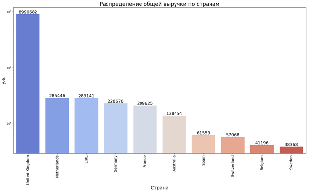

# Анализ продаж британского e-commerce магазина TATA

## Цели проекта

В рамках работы в онлайн-магазине ТАТА, занимающейся продажами мелких бытовых товаров по всему Миру, провести анализ имеющихся у компании данных с целью определения самых востребованных товаров и путей сбыта, составление рекомендаций по продвижению товара, увеличению прибыли и определение основных стейкхолдеров отчетности.

## Бизнес-Задачи

1. Создание формы единого отчета на основе предварительно подготовленных и очищенных данных, что позволит компании создать единую иерархию метрик;
2. Выявление Топов позволит заказчику скорректировать товарную матрицу, снизить % и срок оборачиваемости старого стока, улучшить динамику продаж и повысить прибыль;
3. Анализ основных Тенденций, что позволит создателям новых тайтлов сфокусироваться на выборе направления дальнейшей разработки, а владельцам бизнеса построить стратегию.

## Стейкхолдеры

Менеджеры отдела закупок, Менеджеры экспортного отдела, Менеджеры продаж, Менеджеры отдела маркетинга

---

## Блок 1. Описание исходного датасета и типов данных (8 столбцов)

Для исследования был взят датасет «TATA: Online Retail Dataset» со статистикой продаж товаров. Датасет состоит из 8 столбцов и 541909 строк.

| № | Имя Столбца | Описание | Тип данных |
|---|-------------|----------|------------|
| 1 | InvoiceNo | Номер счет-фактуры | object |
| 2 | StockCode | Артикул товара | object |
| 3 | Description | Описание товара | object |
| 4 | Quantity | Количество товара | Int64 |
| 5 | InvoiceDate | Дата покупки | object |
| 6 | UnitPrice | Цена за единицу товара | Float64 |
| 7 | CustomerID | ID пользователя | Float64 |
| 8 | Country | Страна | object |

## Блок 2. Подготовка и очистка данных

В ходе исследования качества данных были сделаны следующие изменения:

### 2.1. Преобразование

- В столбце "InvoiceDate" — изменен тип данных на `datetime64`
- В столбцах "Quantity" и "UnitPrice" — провели преобразование типа данных с помощью метода `numeric`
- Столбец "InvoiceDate" разбили на несколько столбцов: "Year_month", "Day", "Time" (Год_Месяц, День недели и Время)
- Создали новый столбец "Total" — общая выручка за позицию в счет-фактуре вычисляли по формуле:

```python
data['Total'] = data['Quantity'] * data['UnitPrice']
```

### 2.2. Очистка данных

| № | Новое имя Столбца | Преобразование данных | % NaN | Очистка данных |
|---|-------------------|----------------------|-------|----------------|
| 1 | InvoiceNo | Номер счет-фактуры | 0.00 | Без изменений. Нет пустот |
| 2 | StockCode | Артикул товара | 0.00 | Без изменений. Нет пустот |
| 3 | Description | Описание товара | 0.27 | Пустоты заменены на "Unknown", чтобы не добавлять продажи ни к какому товару, а также не искажать показатели |
| 4 | Quantity | Количество товара | 0.00 | Без изменений. Нет пустот |
| 5 | InvoiceDate | Дата покупки | 0.00 | Без изменений. Нет пустот |
| 6 | UnitPrice | Цена за единицу товара | 0.00 | Без изменений. Нет пустот |
| 7 | CustomerID | ID пользователя | 25.16 | Пустоты заменены на 0, чтобы не добавлять покупки ни к какому покупателю и не искажать общие показатели. |
| 8 | Country | Страна | 0.00 | Без изменений. Нет пустот |

### 2.3. Аномалии в данных

Обнаружены дубликаты значений (5268 значений), которые были удалены. В столбцах "Description" (1454) и "CustomerID" (135073) были обнаружены пропущенные значения, которые составили 0,3% и 25% соответственно от всех данных в этих столбцах. Пустые значения в описании товара мы заменили на "Unknown", а значения "CustomerID" заменили на 0. В дальнейшем при анализе некоторых данных мы исключали эти данные, чтобы не искажать картину.

В столбце "UnitPrice" были обнаружены 3 строки с отрицательными значениями, помеченные как задолженность "Debt". Строки были удалены.

В столбце "Quantity" были также обнаружены отрицательные значения, которые мы записали в отдельный датасет (canceled_purchases — отмененные транзакции) для дальнейшего анализа.

---

## Блок 3. Анализ данных для стейкхолдеров

### 3.1. Анализ возвратов. Общий объём возвратов. Количество возвратов. Наиболее часто возвращаемые товары

Общий объём возвратов составил 893 979,73 у.е. Это составляет 8,6% от общей выручки магазина (10 334 216,8 у.е.), что немного. При этом в сумму возвратов входят банковские сборы, комиссии, плата за обслуживание на сайте Амазона, скидки, почтовые расходы и образцы товаров (табл. 2). Таким образом, большая часть возвратов — это вероятно издержки содержания магазина (расходы). Общее количество отмененных заказов — 3836. Основная часть возвратов из Великобритании — 3372. Интересно, что по количеству отмененных заказов помимо Великобритании лидируют европейские страны: Германия, Ирландия, Франция, Бельгия, Швейцария. При этом по общей денежной сумме возвратов среди Топ-10 стран появляются страны не из Европы: Сингапур, Япония, Гонг-Конг, США. Причём количество отмененных заказов из этих стран небольшое, а средний чек возврата самый высокий. Чаще всего из этих стран возвращали "manual". Средний чек возврата составил 328 у.е.

Мы составили список Топ-10 самых возвращаемых товаров по количеству (табл. 1) и список Топ-10 товаров, принесших максимальный убыток по сумме возврата (табл. 2).

| № | Description | Quantity | Total |
|---|-------------|----------|-------|
| 0 | PAPER CRAFT, LITTLE BIRDIE | -80995 | -168469.60 |
| 1 | MEDIUM CERAMIC TOP STORAGE JAR | -74494 | -77479.64 |
| 2 | ROTATING SILVER ANGELS T-LIGHT HLDR | -9376 | -321.60 |
| 3 | Manual | -4066 | -146784.46 |
| 4 | FAIRY CAKE FLANNEL ASSORTED COLOUR | -3150 | -6591.42 |
| 5 | WHITE HANGING HEART T-LIGHT HOLDER | -2578 | -6624.30 |
| 6 | GIN + TONIC DIET METAL SIGN | -2030 | -3775.33 |
| 7 | HERB MARKER BASIL | -1527 | -841.05 |
| 8 | FELTCRAFT DOLL MOLLY | -1447 | -3512.65 |
| 9 | TEA TIME PARTY BUNTING | -1424 | -3692.95 |

*Таблица 1. Топ-10 самых возвращаемых товаров по количеству.*

| № | Description | Quantity | Total |
|---|-------------|----------|-------|
| 0 | AMAZON FEE | -32 | -235281.59 |
| 1 | PAPER CRAFT, LITTLE BIRDIE | -80995 | -168469.60 |
| 2 | Manual | -4066 | -146784.46 |
| 3 | MEDIUM CERAMIC TOP STORAGE JAR | -74494 | -77479.64 |
| 4 | POSTAGE | -147 | -11871.24 |
| 5 | REGENCY CAKESTAND 3 TIER | -855 | -9697.05 |
| 6 | CRUK Commission | -16 | -7933.43 |
| 7 | Bank Charges | -25 | -7340.64 |
| 8 | WHITE HANGING HEART T-LIGHT HOLDER | -2578 | -6624.30 |
| 9 | FAIRY CAKE FLANNEL ASSORTED COLOUR | -3150 | -6591.42 |

*Таблица 2. Топ-10 товаров по сумме возврата.*

#### Рекомендация Стейкхолдерам

Обратить внимание на товары из этих двух списков и выяснить причину возврата, возможно присутствует брак или другая причина.

---

### 3.2. Анализ общих продаж

География сбыта онлайн-магазина TATA довольно обширная. Поставки идут в 37 стран по всему миру, но основной поток прибыли идёт из Великобритании (рис. 1). В основном покупатели из Европы (топ-10 стран по общей выручке: Нидерланды, Ирландия, Германия, Франция, Испания, Швейцария, Бельгия, Швеция и Австралия), далее идут страны не из Европы, такие как Китай, Израиль, ОАЭ, США, Япония, Бразилия. Общая выручка магазина за исследуемый период составила 10 334 216,804 у.е.


*Рис. 1. Распределение общей выручки по странам (Топ-10 стран).*

По количеству заказов лидирует Великобритания (18 018). Количество заказов из других стран существенно меньше (табл. 3). После Великобритании наибольшее количество заказов поступает из стран Европы: Германия, Франция, Ирландия.

Средний чек покупки составляет 532 у.е. При этом самый высокий средний чек из стран, находящихся за пределами Европы, таких как Сингапур, Австралия, Япония, Ливия, Гонг Конг, Бразилия (табл. 4). Вероятно, из-за дальности расстояния покупатели предпочитают делать крупные заказы, чтобы уменьшить транспортные расходы на доставку, которая очевидно дороже, чем в страны Европы, а также из-за сроков доставки.

| Country | Number of orders |
|---------|------------------|
| United Kingdom | 18018 |
| Germany | 457 |
| France | 392 |
| EIRE | 288 |
| Belgium | 98 |
| Netherlands | 94 |
| Spain | 90 |
| Portugal | 58 |
| Australia | 57 |
| Switzerland | 54 |

*Таблица 3. Количество заказов по странам (Топ-10).*

| Country | Average bill |
|---------|--------------|
| Singapore | 3039.898571 |
| Netherlands | 3036.663191 |
| Australia | 2429.014211 |
| Japan | 1969.282632 |
| Lebanon | 1693.880000 |
| Hong Kong | 1407.545455 |
| Brazil | 1143.600000 |
| Sweden | 1065.773056 |
| Switzerland | 1056.807407 |
| Denmark | 1053.074444 |

*Таблица 4. Размер среднего чека покупки по странам (Топ-10).*

#### Рекомендация Стейкхолдерам

Уделить приоритетное внимание маркетингу в Великобритании как стране с наибольшим количеством клиентов и сделок. Руководителям и менеджерам экспортного департамента необходимо сосредоточиться на увеличении клиентской базы партнеров из списка стран Топ-10.

Продумать условия доставки и сделать их более гибкими для покупателей не из Европы.

---

### 3.3. Анализ наиболее популярных товаров

| Description | UnitPrice min | UnitPrice max | UnitPrice sum | Quantity sum | Total sum |
|-------------|---------------|---------------|---------------|--------------|-----------|
| 4 PURPLE FLOCK DINNER CANDLES | 0.79 | 0.79 | 0.79 | 49 | 38.71 |
| 50'S CHRISTMAS GIFT BAG LARGE | 1.04 | 1.04 | 1.04 | 400 | 416.00 |
| 50'S CHRISTMAS GIFT BAG LARGE | 1.25 | 1.25 | 1.25 | 1487 | 1858.75 |
| 50'S CHRISTMAS GIFT BAG LARGE | 2.46 | 2.46 | 2.46 | 28 | 68.88 |
| DOLLY GIRL BEAKER | 1.08 | 1.08 | 1.08 | 1400 | 1512.00 |
| DOLLY GIRL BEAKER | 1.25 | 1.25 | 1.25 | 1001 | 1251.25 |
| DOLLY GIRL BEAKER | 2.46 | 2.46 | 2.46 | 50 | 123.00 |
| I LOVE LONDON MINI BACKPACK | 3.75 | 3.75 | 3.75 | 100 | 375.00 |
| I LOVE LONDON MINI BACKPACK | 4.15 | 4.15 | 4.15 | 275 | 1141.25 |
| I LOVE LONDON MINI BACKPACK | 8.29 | 8.29 | 8.29 | 13 | 107.77 |
| I LOVE LONDON MINI RUCKSACK | 4.15 | 4.15 | 4.15 | 1 | 4.15 |
| NINE DRAWER OFFICE TIDY | 12.50 | 12.50 | 12.50 | 12 | 150.00 |

*Таблица 5. Разброс цены за единицу товара.*

Из таблицы 5 мы видим, что цена на товар неодинаковая. Чем меньше цена, тем большее количество товара было продано. Скорее всего действуют оптовые скидки при покупке свыше определенного количества товара. Цена в розницу и оптовая цена различаются почти в два раза. Кроме того, скорее всего за исследуемый период было небольшое повышение цен. В декабре 2010 цена была одна, а уже в ноябре 2011 было повышение цен.

При анализе наиболее популярных товаров и наиболее часто возвращаемых мы заметили, что два наименования товара присутствуют и в одном и в другом списке. Оказалось, что эти два товара были приобретены крупной партией и почти сразу (через 15 минут) был сделан возврат, что весьма странно. Для получения более объективной картины мы убрали эти два товара и получили следующий список Топ-10 наиболее продаваемых товаров (рис. 2).


*Рис. 2. Наиболее часто продаваемые товары (Топ-10).*

Также мы составили список из товаров, принесших наибольшую выручку. Некоторые товары есть в обоих списках. В дальнейшем можно более тщательно рассмотреть эти позиции.


*Рис. 3. Товары, принесшие максимальную выручку (Топ-10).*

#### Рекомендация Стейкхолдерам

Сосредоточить маркетинговые усилия на товарах из списка Топ-10. Закупщикам рекомендуется постоянно мониторить динамику продаж и поддерживать наличие этих товаров, что позволит снизить срок оборачиваемости и повысить прибыль. Топ-10 можно разместить на первых страницах каталога товаров, чтобы сразу направить клиента в выборе качественного и интересного продукта, что повысит продажи.

---

### 3.4. Динамика продаж

#### 3.4.1. Динамика продаж по месяцам

Для анализа предоставлены данные за декабрь 2010 года и за 2011 год. Причём за декабрь 2011 года данные неполные. Данные есть только за период 1.12–09.12.

В 2011 году самые высокие продажи были в ноябре. Из рисунка 4 видно, что, начиная с сентября продажи растут, достигая максимума в ноябре. В декабре 2011 продажи падают, при этом в декабре 2010 года продажи были почти в два раза выше. Это связано с тем, что данные за декабрь 2011 года неполные. Возможно максимальные продажи могли быть в декабре 2011 года. Самые минимальные продажи были в феврале и апреле. В остальные месяцы общий объём продаж держится примерно на одном уровне около 700 тыс. у.е.


*Рис. 4. Динамика продаж по месяцам.*

Количество заказов, как и выручка, максимально в ноябре. Все осенние месяцы характеризуются высоким количеством заказов. Минимальное количество заказов в декабре 2011, что опять же связано с неполнотой данных за этот месяц. В зимние месяцы наблюдается снижение количества заказов по сравнению с другими месяцами. Весной количество заказов растет и остается примерно одинаковым в течение лета.

Размер среднемесячной выручки 799 тыс. у.е. Минимальная выручка 523 тыс. у.е. (в апреле), максимальная 1504 тыс. у.е. (в ноябре).

#### 3.4.2. Динамика продаж по дням недели

В датасете отсутствуют данные по транзакциям за субботы, что странно.

Больше всего продаж совершается в четверг и вторник, а также в среду (рис. 5). Меньше всего было продано в воскресенье.


*Рис. 5. Динамика изменения общей суммы выручки по дням недели.*

Максимальное количество заказов также в четверг, вторник и среду.

При этом максимальный средний чек покупки во вторник и понедельник. Более дорогие покупки покупатели предпочитают делать в первой половине недели, обдумав их за выходные.

Начиная с пятницы, люди готовятся к выходным и покупки предпочитают делать в середине рабочей недели, при этом самые дорогие покупки предпочитают делать в начале недели.


*Рис. 6. Динамика изменения количества заказов в течение недели.*


*Рис. 7. Изменение размера среднего чека в течение недели.*

#### Рекомендации Стейкхолдерам

Расставить приоритеты в маркетинге по четвергам, вторникам и средам. Этого можно добиться, предлагая больше предложений в эти дни.

#### 3.4.3. Динамика продаж в течение дня

Наибольшее количество заказов совершается в промежуток времени с 12 до 14 часов дня, когда у большинства покупателей обеденный перерыв (рис. 8).


*Рис. 8. Изменение количества заказов в течение дня.*


*Рис. 9. Изменение размера среднего чека в течение дня.*

Максимальный размер среднего чека наблюдается в 7 утра и в 8 вечера. Вероятно, люди предпочитают делать дорогие покупки рано утром до работы или после работы. Либо причина в разнице во времени для покупателей не из Европы, средний чек которых выше, чем у покупателей из Европы. Требует дальнейшего анализа.

#### Рекомендация Стейкхолдерам

Рекомендуется показывать рекламу в обеденное время с 12 до 16 часов дня, а также рано утром и в вечернее время.

---

### 3.5. Анализ покупательской активности

Общее количество уникальных покупателей магазина — 4341. Максимальное количество покупателей из Великобритании (3919 человек). В остальных странах количество покупателей существенно меньше. В Германии и Франции около 100 покупателей. В остальных странах меньше 30 или единицы (табл. 5).

| Country | CustomerID |
|---------|------------|
| United Kingdom | 3919 |
| Germany | 94 |
| France | 87 |
| Spain | 30 |
| Belgium | 25 |
| Switzerland | 21 |
| Portugal | 19 |
| Italy | 14 |
| Finland | 12 |
| Austria | 11 |

*Таблица 5. Количество покупателей по странам.*

Среднее количество заказов на одного человека — 4. Если посмотрим эту же величину по странам, то увидим, что в Ирландии на одного человека приходится в среднем 86 заказов, в то время как в других странах меньше 10 заказов (табл. 6). Интересно, что в Ирландии проживает всего три уникальных покупателя, при этом количество покупок и общая выручка входит в топ-10 стран по общей выручке магазина.

| Country | Average orders per customer |
|---------|----------------------------|
| EIRE | 86.666667 |
| Netherlands | 10.444444 |
| Singapore | 7.000000 |
| Iceland | 7.000000 |
| Australia | 6.333333 |
| Germany | 4.861702 |
| Sweden | 4.500000 |
| France | 4.471264 |
| United Kingdom | 4.247002 |
| Lithuania | 4.000000 |

*Таблица 6. Среднее количество заказов на одного человека.*

#### Рекомендация Стейкхолдерам

Возможно покупателям из Ирландии стоит предложить специальные условия. Также менеджерам по продажам стоит сосредоточиться на увеличении клиентской базы из стран Европы.

---

## Итоги проекта и заключение

В результате проведенного анализа данных мы делаем вывод, что дела у магазина ТАТА идут хорошо. Сумма возвратов составляет не более 8,4% от общей выручки магазина. Основная выручка магазина идет из Великобритании. Из других стран прибыль значительно меньше. При этом покупатели не из Европы предпочитают совершать покупки на крупный чек, очевидно делая оптовые заказы. В целом наблюдается положительная динамика роста прибыли в течение анализируемого периода.

Для владельцев онлайн-магазина ТАТА были найдены некоторые инсайты и даны рекомендации, которые смогут помочь им в построении стратегии на будущее и улучшении своих показателей.

### По бизнес-задачам

1. Для задачи построения единого отчета были преобразованы и очищены имеющиеся у компании сырые данные: удалены дубликаты, пропуски заполнены, отрицательные значения 'Quantity' (количество товара) были записаны в отдельный датасет, что позволило более детально проанализировать возвраты. Качество данных было повышено, что позволит выработать единую иерархию метрик и внедрить их в компанию.

2. Анализ продаж с выявлением Топов позволил определить основных стейкхолдеров, основные метрики и предоставить рекомендации по их улучшению: Менеджеры отдела закупок, Менеджеры экспортного отдела, Менеджеры продаж, Менеджеры отдела маркетинга.

3. Анализ динамики продаж показал, что дела у магазина идут хорошо. Наблюдается положительная динамика роста продаж к концу года, особенно в ноябре. Больше всего покупок совершается в будние дни (в середине недели) в первой половине дня. Анализ данных позволил выявить благоприятные часы для показа рекламной компании, а также дни и месяцы, в которые следует сосредоточить маркетинговые усилия.

### Рекомендации

- В ходе анализа было выявлено отсутствие некоторых данных, необходимых для предоставления четких выводов, поэтому для улучшения качества данных необходимо доработать отчет и дополнить данные следующей информацией: данные о продажах магазина по субботам, данные о продажах за декабрь 2011 года.
- Добавить информацию о типе каждого товара, например, одежда, сумки, украшения и т.д. для более детального анализа данных.
- Расставить приоритеты в маркетинге в будние дни, особенно по четвергам, этого можно было бы добиться, рекламируя больше предложений по четвергам.
- Размещать рекламу в первой половине дня, особенно в обеденное время с 12–14 дня.
- Уделить приоритетное внимание маркетингу в Великобритании, как стране с наибольшим количеством клиентов и сделок.
- Сосредоточить маркетинг на самых продаваемых продуктах Топ-10.
- Ориентироваться на тех покупателей, которые не тратят много денег, продавая больше товаров по цене от 1,9 до 2,7 долларов.
- Для покупателей не из Европы сделать более гибкие условия доставки для оптовых закупок. Предлагать больше товаров по оптовым ценам.
